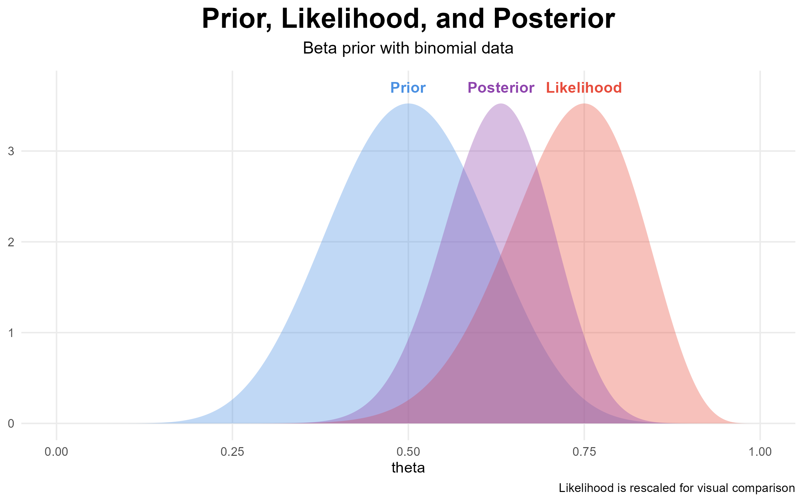

# Bayesian Shot Simulation

## Overview
This project simulates a sequence of Bernoulli trials (shots) and performs Bayesian updating using a Beta prior and Binomial likelihood. The goal is to visualize how beliefs about a success probability evolve with observed data.

## Model
- Prior: Beta(10, 10)
- Likelihood: Binomial(N, θ)
- Posterior: Beta(10 + successes, 10 + failures)

## Features
- Simulates shot outcomes
- Computes prior, likelihood, and posterior
- Visualizes all three distributions on the same plot

## Example Output


## How to Run
```r
source("R/bayesian_shot_simulation.R")
